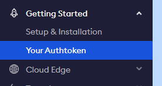
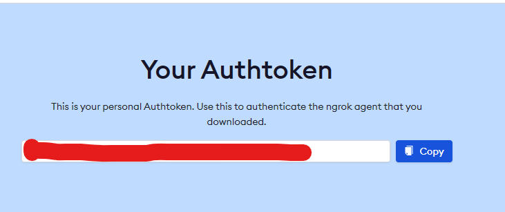

# Welcome to GlobalShut!
Welcome back! Excited to see you to use GlobalShut!
# Compatibility
Currently, The Open-Source GlobalShut is only compatible with Windows 7 and above. Though this is one of its greatest disadvantages, It has many features that can help us significantly.
# Installing GlobalShut
You can't install GlobalShut on your device but you can download Its source code and set the environment variables to run it.
# Setting up the Environment variables
First, You have to create an <a href="https://dashboard.ngrok.com/signup">NGROK account</a> and then you have to follow the following steps:-
# Steps
Step 1.
In the first step, You must have logged in to your NGROK account. Click the Auth token option in the menu like the image below:-

 
Step 2.
Now, You have to get the secret token from your NGROK account from the top of the page like the image below. Copy it.
 

 
Step 3.
You must install all the modules and APIs used by GlobalShut by clicking on the <code>start_install.bat</code> file
 
Step 4. Use the token from your NGROK account when asked for.
<h1>NOTICE!</h1>
Do not share this token with anyone else. Doing so may destroy your NGROK account. GlobalShut doesn't share your NGROK token to anyone else.
After you are ready with the token, start GlobalShut using the <code>start.bat</code> file. When asked for the token, enter it. You have successfully setup GlobalShut on your computer!
Thank you!
